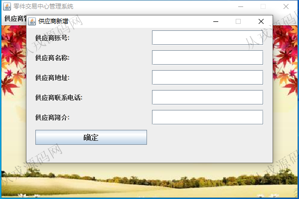
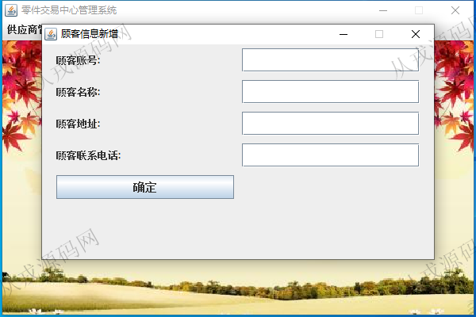
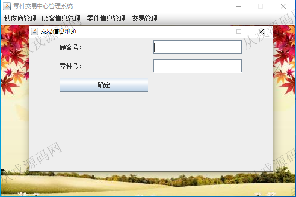

<h1 align="center">198.零件交易中心管理系统</h1>

 获取sql文件 QQ: 386869957 QQ群: 377586148 

 [更多源码项目: 从戎源码网](https://armycodes.com/) 

## 简介

> 本代码来源于网络,仅供学习参考使用!
>
> 提供1.远程部署/2.修改代码/3.设计文档指导/4.框架代码讲解等服务
> 

## 项目介绍
基于java+swing+awt的零件交易中心管理系统：集成供应商管理、顾客信息管理、零件信息管理、交易管理等功能于一体的系统。

## 功能介绍

- 基本功能：登录，注册
- 供应商管理：供应商信息的增删改查，供应商零件信息的增删改查
- 顾客信息管理：顾客信息的增删改查，顾客零件信息的增删改查
- 零件信息管理：零件信息的增删改查
- 交易管理：交易信息维护

## 环境

- <b>IntelliJ IDEA 2021.3</b>

- <b>Mysql 5.7.26</b>

- <b>JDK 1.8</b>

## 运行截图

